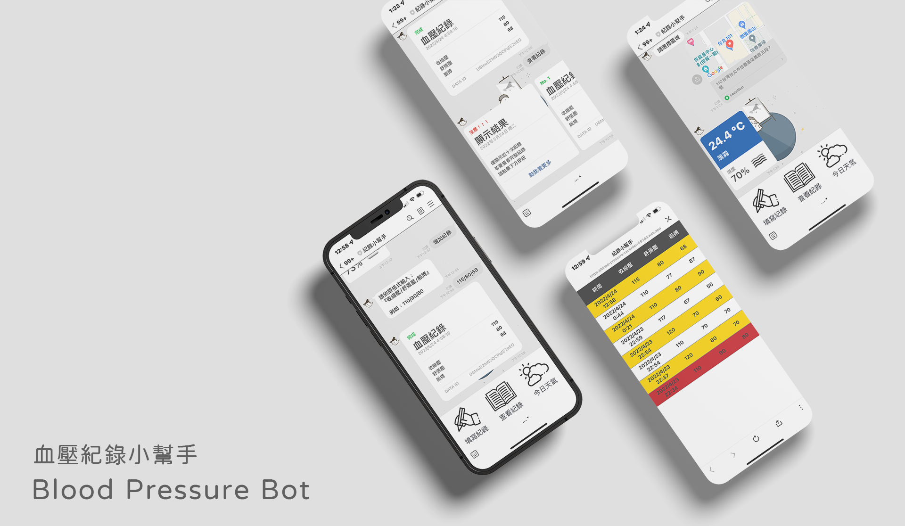

# **Blood Pressure Bot**

## **Introduction**
Using Line Bot to record daily blood pressure, users
can easily view records from the bot or the web.

> **Bot**

- The bot is built with [Bottender](https://github.com/Yoctol/bottender)

- Bot is deploy at Heroku.

- Add the bot as your friend below:
    
    

> **Web**

- The web is built with [React](https://reactjs.org/)

- Web is deploy at Firebase.

- Check Personal Data at:

    - ` https://blood-pressure-recorder-493d0.web.app/{userID} `

## **Features**

:rocket: Add record（增加紀錄）

:rocket: View records（查看紀錄）

:rocket: Check the weather（查看當下天氣）

## **Future Features**

- [ ] 分類篩選（年月份）
- [ ] 快速查詢（依照日期）
- [ ] Loading動畫
- [ ] 優化web介面
- [ ] 增加血糖、體重
    - [ ] Web端
    - [ ] Bot端
    - [ ] Firestore
- [x] 指數超標顏色警告（黃色、紅色）

